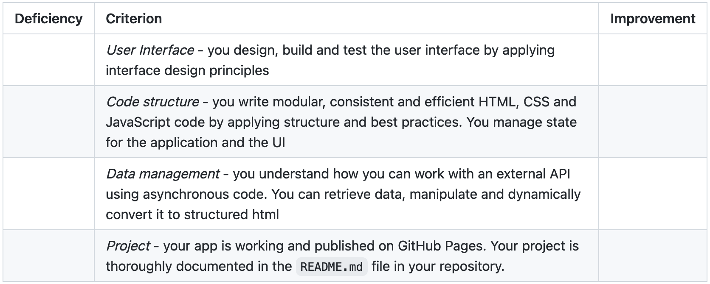

# Web apps from scratch
Welkom bij mijn project van [Web apps from scratch](https://github.com/cmda-minor-web/web-app-from-scratch-2122 "Google's Homepage"). 

De website is [hier](https://github.com/cmda-minor-web/web-app-from-scratch-2122 "Google's Homepage") te zien.

FOTO

### User story
> As an art lover, I want to be able to search and view art from the Rijksmuseum at home, so that I can still enjoy art during a lockdown

### Installatie ⚙️

Om de app lokaal te laten draaien moet het project eerst lokaal worden gecloned.
Als dit stukje code gerunt wordt in de terminal wordt de repository lokaal gecloned:

`gh repo clone tomvandenberg11/rijksmuseum-app`

Ga eerst naar de folder waarin je wilt dat het project gecloned wordt. Je kan in de terminal navigeren met `cd` met daar achter de map waar je heen wilt.

Hierna kan het bestand gewoon geopend worden in de browser door dubbel te klikken op de `index.html`.
## Rubrics 🅰️

## Licence 👨🏻‍⚖️

Dit project is voorzien van een MIT licence. Zie de pagina LICENCE voor meer informatie.

## Credits 📣

Ik wil graag als eerste de docenten bedanken voor al hun inzet, uitleg en lesstof. Ten tweede wil ik mijn supportgroepje bedanken voor de mentale en functionele support. Ten derde wil ik Stackoverflow bedanken voor al hun antwoorden op mijn vragen.
