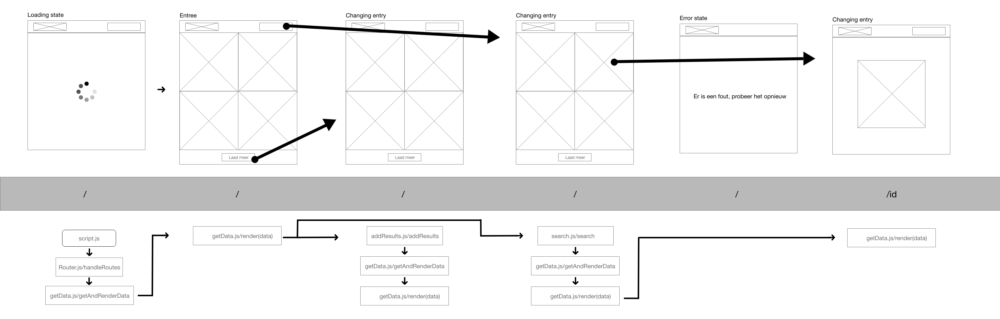

# Web apps from scratch

Welkom bij mijn project van [Web apps from scratch](https://github.com/cmda-minor-web/web-app-from-scratch-2122 "Google's Homepage"). Bij dit van de Minor 'Webdesign and development' is het de bedoeling dat we een single page app gaan maken. Ik heb ervoor gekozen om hierbij de Rijksmuseum API te gebruiken.

De website is [hier](https://tomvandenberg11.github.io/rijksmuseum-app/ "Rijksmuseum app") te zien.

#### Andere uitgewerkte opdrachten voor dit vak:

- [Visitekaartje](https://tomvandenberg11.github.io/rijksmuseum-app/visitekaartje/)
- [Teampagina](https://tomvandenberg11.github.io/team4-wafs-2022/)

## Inhoudsopgave

- [User Story](https://github.com/Tomvandenberg11/rijksmuseum-app#user-story)
- [Activity Diagram](https://github.com/Tomvandenberg11/rijksmuseum-app#activity-diagram)
- [Hoe te gebruiken?](https://github.com/Tomvandenberg11/rijksmuseum-app#hoe-te-gebruiken)
- [Installatie](https://github.com/Tomvandenberg11/rijksmuseum-app#installatie)
- [API](https://github.com/Tomvandenberg11/rijksmuseum-app#api)
- [To do](https://github.com/Tomvandenberg11/rijksmuseum-app#to-do)
- [Rubrics](https://github.com/Tomvandenberg11/rijksmuseum-app#rubrics)
- [Licence](https://github.com/Tomvandenberg11/rijksmuseum-app#licence)
- [Credits](https://github.com/Tomvandenberg11/rijksmuseum-app#credits)

## User Story

> As an art lover, I want to be able to search and view art from the Rijksmuseum at home, so that I can still enjoy art during a lockdown

## Activity Diagram

## Hoe te gebruiken?

De website is gemaakt om de kunst uit het Rijksmuseum te laten zien. De gebruiker kan door middel van de zoekbalk zoeken op schilders of schilderijen. Ook kan de gebruiker meerdere resultaten inladen door op de 'Laad meer' knop te drukken. Als er op een schilderij geklikt wordt ziet de gebruiker het schilderij in de goede afmetingen, met meer informatie. Ook is er een link te vinden die verwijst naar de Rijksmuseum website, waar nóg meer informatie te zien is over het kunstwerk.

## Installatie ⚙️

Om de app lokaal te laten draaien moet het project eerst lokaal worden gecloned.
Als dit stukje code gerunt wordt in de terminal wordt de repository lokaal gecloned:

`gh repo clone tomvandenberg11/rijksmuseum-app`

Ga eerst naar de folder waarin je wilt dat het project gecloned wordt. Je kan in de terminal navigeren met `cd` met daar achter de map waar je heen wilt.

Hierna kan het bestand gewoon geopend worden in de browser door dubbel te klikken op de `index.html`.

## API

Voor dit project heb ik de API van het Rijksmuseum gebruikt. De API is vrij te gebruiken en bevat zo goed als alle
schilderijen in het Rijksmuseum. Meer informatie over deze API vind je [hier](https://data.rijksmuseum.nl/object-metadata/api/).

## To do

| To do                             | Done? |
| :-------------------------------- | :---: |
| Showing all results               |  ✅   |
| Empty results after search        |  ✅   |
| Dynamic search                    |  ✅   |
| Load more images button           |  ✅   |
| Error states                      |  ✅   |
| Loading images state              |  ✅   |
| Modal screen onclick images       |  ✅   |
| Implement hashing and routing     |  ✅   |
| Better styling on single art page |       |
| Enabling full page artwork        |       |

## Rubrics 🅰️

## Licence 👨🏻‍⚖️

Dit project is voorzien van een MIT licence. Zie de pagina LICENCE voor meer informatie.

## Credits 📣

Ik wil graag als eerste de docenten bedanken voor al hun inzet, uitleg en lesstof. Ten tweede wil ik mijn supportgroepje bedanken voor de mentale en functionele support. Ten derde wil ik Stackoverflow bedanken voor al hun antwoorden op mijn vragen.
